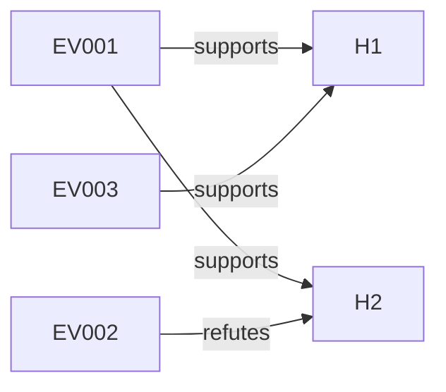

# EVIDENCE-PACK-PROTOCOL.md — Structured Evidence with EV-NNN#E&lt;n&gt; Anchors

<!-- TOC: Why an evidence pack | File layout | The EV-NNN#E n anchor scheme | Evidence record schema | Anchor formats | Excerpt-first design | The "supports" + "refutes" graph | Per-phase evidence pack workflow | What gets committed vs not | Cross-session evidence pack reuse | Anti-patterns | Cross-references -->

A real session's artifact cites 10-30 evidence records. Without structured tracking, citations decay into "the paper said something like..." and audit becomes impossible.

Brenner_bot pioneered an **evidence pack** abstraction: session-scoped, excerpt-first, anchor-stable, locally-stored. Every external claim in the artifact resolves back to a verbatim or paraphrased excerpt with provenance.

Mined from `/dp/brenner_bot/specs/evidence_pack_v0.1.md` and the real-session example at `/dp/brenner_bot/artifacts/RS-20260101-cell-fate/`.

---

## Why an evidence pack

Three failures of citation-by-prose:

1. **No verbatim anchor** — "the paper showed X" without quoting it; future verifiers can't trace
2. **Bibliographic drift** — references morph across drafts; what once was Smith 2018 becomes Smith 2019 silently
3. **No excerpt boundary** — entire papers cited when only one paragraph matters

Three benefits of structured evidence packs:

1. **Excerpt-first** — only the snippets that actually inform the artifact are stored
2. **Anchored** — every claim cites `EV-NNN#E<n>` or `[inference]`
3. **Audit-stable** — the excerpts persist across distillations, audit rounds, and HANDBACK

For T3+ sessions, the evidence pack is mandatory. For T1-T2, optional but recommended.

---

## File layout

Evidence packs live alongside session artifacts:

```
artifacts/
└── <thread_id>/
    ├── artifact.md           # The compiled 7-section artifact
    ├── evidence.json         # Evidence pack (structured data)
    └── evidence.md           # Evidence pack (human-readable rendering)
```

Example: `artifacts/RS-20260101-cell-fate/evidence.json`

This co-location is intentional:
- Evidence and artifact stay together (cross-session diff stable)
- Thread-scoped (join-key = folder name)
- Git-friendly (small JSON; excerpts keep packs reasonable size)

---

## The `EV-NNN#E<n>` anchor scheme

Every evidence record has a stable ID. Excerpts within a record have internal anchors:

```
EV-001                  # The whole record (paper, dataset, etc.)
EV-001#E1               # First excerpt within EV-001
EV-001#E2 [verbatim]    # Second excerpt, marked as direct quote
EV-001#E3 [paraphrase]  # Third excerpt, paraphrased summary
EV-002#E1 [inference]   # Excerpt that's an inference from cited material
```

The anchor scheme:
- `EV-` prefix for evidence records
- 3-digit zero-padded sequence number
- `#E<n>` to address a specific excerpt within the record
- `[verbatim]` / `[paraphrase]` / `[inference]` markers for citation type

Anchors appear in artifact sections wherever a claim is grounded:

```markdown
**Claim**: PAR proteins establish A-P polarity through cortical flows
**Anchors**: EV-001#E1 [verbatim], EV-002#E1
```

Per CITATION-PROVENANCE-RULES.md: every load-bearing artifact claim must have ≥1 anchor (or `[inference]` marker if it's the agent's reasoning).

---

## Evidence record schema

```typescript
interface EvidencePack {
  version: "0.1";
  thread_id: string;       // RS-YYYYMMDD-slug
  created_at: string;      // ISO 8601
  updated_at: string;
  next_id: number;         // counter for ID generation
  records: EvidenceRecord[];
}

interface EvidenceRecord {
  id: string;              // EV-001, EV-002, ...
  type: EvidenceType;      // paper | dataset | experiment | session | website | code | manual
  title: string;
  authors?: string[];
  date?: string;
  source: string;          // URL, DOI, file path, or session ID
  access_method: "url" | "doi" | "file" | "session" | "manual";
  imported_at: string;
  imported_by: string;     // agent name or "operator"
  relevance: string;       // why this evidence matters
  key_findings: string[];
  supports?: string[];     // ["H1", "T3"] - artifact items this supports
  refutes?: string[];      // ["H2"] - artifact items this refutes
  excerpts: Excerpt[];
  verified: boolean;
  verification_note?: string;
}

interface Excerpt {
  anchor: string;          // EV-001#E1
  type: "verbatim" | "paraphrase" | "inference";
  section?: string;        // "Section 2.1, p. 127" for papers
  content: string;         // the actual excerpt text
}
```

### Evidence types

| Type | Source pattern |
|------|------------------|
| `paper` | DOI or URL to a peer-reviewed paper |
| `dataset` | URL to a public dataset (e.g., WormBase) |
| `experiment` | Internal experiment result file |
| `session` | Reference to another brennerbot session |
| `website` | Non-paper web source (blog, docs) |
| `code` | GitHub repo or local code path |
| `manual` | Operator-entered, no formal source |

### Verification

The `verified` boolean indicates whether someone has actually opened the source and confirmed the excerpt. `imported_by: agent` + `verified: false` means an agent claims the source exists but no human confirmed.

For T4+ sessions: `verified: false` evidence cannot ground a `severity: critical` critique. Per VERIFICATION-FIRST.md.

---

## Anchor formats (full taxonomy)

Beyond `EV-NNN#E<n>`, the citation system uses several anchor types (per CITATION-PROVENANCE-RULES.md):

| Anchor format | Meaning | Example |
|---------------|---------|---------|
| `§n` | Brenner transcript section | `§103` |
| `§n, §m, ...` | Multi-source quote | `§103, §105` |
| `EV-NNN` | Whole evidence record | `EV-007` |
| `EV-NNN#E<n>` | Specific excerpt | `EV-007#E2` |
| `EV-NNN#E<n> [verbatim]` | Direct quote | `EV-007#E2 [verbatim]` |
| `[inference]` | Agent reasoning beyond evidence | `[inference]` |
| `[inference] from §n` | Inference grounded in source | `[inference] from §58` |
| `[synthesis]` | Synthesis across multiple distillations | `[synthesis]` |
| `[external: source]` | Non-corpus, non-evidence source | `[external: NIST AI RMF 1.0]` |
| `[axiomatic]` | Foundational assumption (no further justification) | `[axiomatic]` |

Per ARTIFACT-LINTER-RULES.md citation rules (EH-006, WT-004, WC-003), every load-bearing claim has one of these.

---

## Excerpt-first design

A common anti-pattern: store the entire paper, then cite it. Brenner-style: store **only the excerpts that ground the artifact**.

Why?

- **Copyright safety** — full PDFs may be copyrighted; excerpts under fair use
- **Audit clarity** — the verifier sees exactly what informed the claim
- **Drift resistance** — the relevant snippet is locked even if the source changes online
- **Size control** — packs stay small; commit-friendly

Practice:
1. When citing a paper, locate the specific paragraph/figure
2. Copy ≤300 words verbatim into the excerpt
3. Mark `type: "verbatim"` and note the section
4. Cite via `EV-NNN#E<n> [verbatim]` in the artifact

For paraphrases: ≤100 words; mark `type: "paraphrase"`.

For inferences: explicit `type: "inference"`; never disguise as verbatim.

---

## The `supports` + `refutes` graph

Each evidence record can declare which artifact items it supports / refutes:

```json
{
  "id": "EV-002",
  "supports": ["H1", "H4"],
  "refutes": ["H2"]
}
```

This builds a **bipartite graph** between evidence and artifact items:

- Per H, count supporting EVs vs refuting EVs → confidence delta
- Per EV, count items affected → leverage measure
- Cross-session: detect EVs that consistently refute the same H type

`scripts/evidence-graph.sh` (already in skill scripts) renders this as Mermaid:



Per Phase 7 audit: H with `state: confirmed` should have ≥2 supporting EVs and ≥0 refuting EVs (otherwise audit-finding).

---

## Per-phase evidence pack workflow

| Phase | Activity |
|-------|----------|
| 1 framing | (Optional) ingest 1-3 seed sources; create initial pack |
| 3 hypothesis | (Light) reference initial pack; H beads cite EV-NNN |
| 4 investigation | **Heavy**: investigators import sources; pack grows; per-H evidence packs (`evidence/packs/EV-pack-H-NNN.md`) compiled |
| 5 cross-exam | Critics cite refuting evidence (`refutes: [H-NNN]`) |
| 6 distillation | (Read-only) distillations cite EV anchors |
| 7 audit | Anchor density check (per `scripts/check-anchor-density.sh`) |
| 8 freeze | `evidence.json` + `evidence.md` rendered + committed |
| 9 handback | HANDBACK § Verdict cites top EVs per surviving H |

### Importing evidence

Per `/dp/brenner_bot/README.md § Create and cite evidence packs`:

```bash
brenner evidence import \
  --thread-id RS-... \
  --type paper \
  --source "doi:10.1146/annurev-cellbio-100913-013027" \
  --title "Asymmetric cell divisions and cell fate specification in C. elegans" \
  --authors "Rose, Gonczy" \
  --date "2014" \
  --relevance "Canonical review of asymmetric divisions" \
  --excerpt-file excerpt.txt \
  --excerpt-section "Section 2.1, p. 127" \
  --excerpt-type verbatim \
  --imported-by GreenCastle
```

Output: a new `EV-NNN` record with stable ID + initial `EV-NNN#E1` excerpt.

Subsequent excerpts append:

```bash
brenner evidence add-excerpt \
  --thread-id RS-... \
  --record-id EV-007 \
  --section "Figure 3 caption" \
  --excerpt-file excerpt2.txt \
  --type paraphrase
```

---

## What gets committed vs not

| Content | Committed? | Why |
|---------|------------|-----|
| `evidence.json` (metadata + excerpts) | ✓ | Small, essential for reproducibility |
| `evidence.md` (rendered view) | ✓ | Human-readable audit trail |
| Full PDFs / datasets | ✗ | Copyright; size bloat |
| External URLs / DOIs | ✓ (in metadata) | Provenance without storage |
| Internal experiment files | ✗ unless small | Can grow large |

For T4+ sessions exporting reproducibility packages: `scripts/export-reproducibility-package.sh` bundles `evidence.json` + per-EV-source URLs (not the source content) for external reproduction.

---

## Cross-session evidence pack reuse

When two sessions cite the same source, the reuse pattern:

```bash
brenner evidence import-from-session \
  --thread-id RS-NEW-... \
  --from-session RS-OLD-... \
  --record-ids EV-007,EV-014
```

This copies the EV records into the new session's pack with **new IDs** (e.g., `EV-007` from old session becomes `EV-002` in new). The original anchors are preserved as `imported_from: RS-OLD-...:EV-007`.

Why new IDs? Because per-session sequential numbering is cleaner. Why track `imported_from`? Because cross-session reconciliation (per RECONCILIATION-OF-PRIOR-SESSIONS.md) needs to know which EVs are shared.

---

## Anti-patterns

| ✗ | Why |
|---|-----|
| Cite a paper without an excerpt | Future verifier can't audit |
| Store the full PDF in the repo | Copyright + size |
| Use `[inference]` to hide weak evidence | Be honest; mark as inference *and* note the gap |
| Reuse `EV-NNN` IDs across sessions | Sequential per session; cross-session use `imported_from` |
| Skip `verified` field | Default to false; verify before T4+ critical citations |
| Cite by URL only | URLs rot; include excerpt + access date |
| Excerpts > 300 words | Likely fair-use violation; choose tighter snippet |
| Mix verbatim + paraphrase in one excerpt | Type each separately |
| Forget `supports`/`refutes` fields | Loses the graph; Phase 7 audit can't compute confidence aggregation |

---

## Cross-references

- [CITATION-PROVENANCE-RULES.md](CITATION-PROVENANCE-RULES.md) — full anchor taxonomy
- [ARTIFACT-7-SECTION-SCHEMA.md](ARTIFACT-7-SECTION-SCHEMA.md) — where EV anchors land in artifact
- [ARTIFACT-LINTER-RULES.md](ARTIFACT-LINTER-RULES.md) — anchor-presence rules
- [VERIFICATION-FIRST.md](VERIFICATION-FIRST.md) — verified flag; T4+ critical-citation rules
- [EVIDENCE-WEIGHTING-TAXONOMY.md](EVIDENCE-WEIGHTING-TAXONOMY.md) — W-axis scoring per EV
- [scripts/check-anchor-density.sh](../scripts/check-anchor-density.sh) — anchor coverage checker
- [scripts/evidence-graph.sh](../scripts/evidence-graph.sh) — Mermaid graph rendering
- [scripts/export-reproducibility-package.sh](../scripts/export-reproducibility-package.sh) — T4+ packaging
- /dp/brenner_bot/specs/evidence_pack_v0.1.md — original spec
- /dp/brenner_bot/artifacts/RS-20260101-cell-fate/ — exemplar pack
